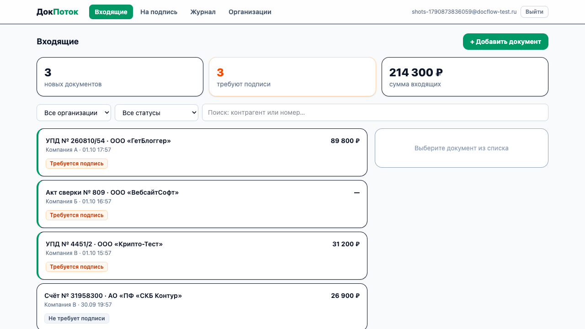
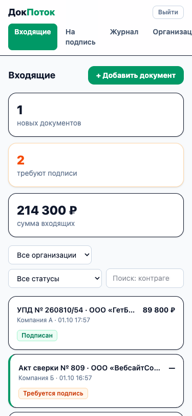
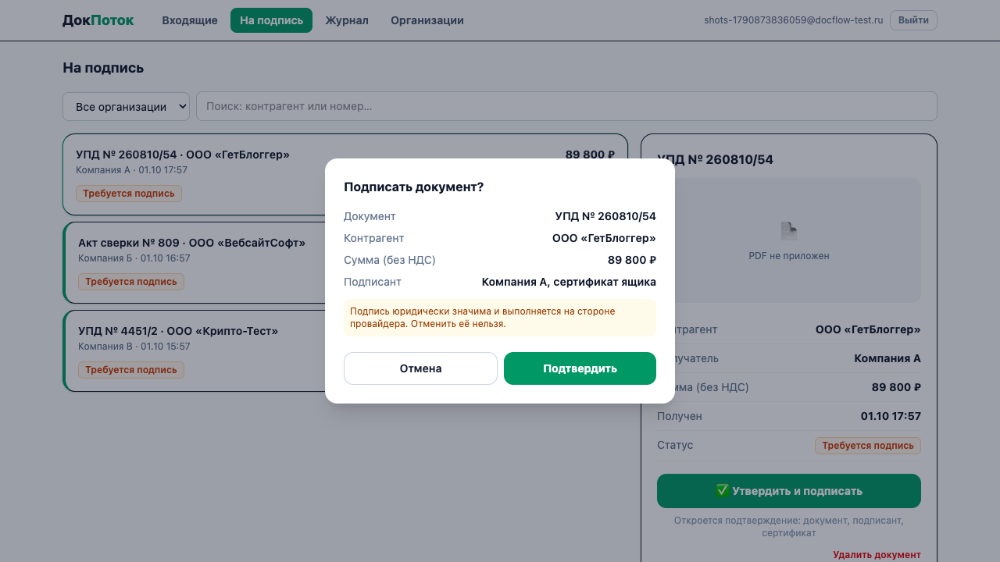
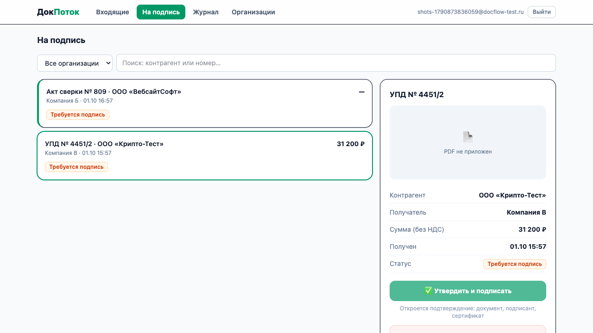

# ДокПоток — единая входящая ЭДО для группы компаний

**Приложение:** https://topchiiaa-eng.github.io/docflow/ · **CI/CD:** [GitHub Actions](https://github.com/topchiiaa-eng/docflow/actions) · **Проектная работа курса «Разработка с AI-агентами»**

Операционный менеджер группы из нескольких юрлиц вынужден обходить ящик ЭДО каждой организации по очереди — документы замечают с опозданием, «требуется подпись» теряется между ящиками. **ДокПоток** собирает входящие всех организаций в одну ленту, даёт очередь «на подпись» с явным подтверждением по ролям, журнал подписаний и хранилище PDF. У ЭДО-провайдеров «несколько юрлиц» — это переключатель контекста, а не единая лента ([анализ конкурентов](docs/competitors.md)).

Идея выросла из реальной практики автора (три юрлица в Контур.Диадоке, мониторинг Telegram-ботом) и прошла все этапы курса: [ТЗ и UI-концепции](https://github.com/topchiiaa-eng) → фронтенд → Supabase-бэкенд → CI/CD, аудит, интеграции. Разработано в паре с AI-агентом **Claude Code** по правилам проекта [CLAUDE.md](CLAUDE.md); процесс по этапам — [docs/development_process.md](docs/development_process.md).

## Скриншоты

| Входящие (desktop) | Мобильная версия |
|---|---|
|  |  |

| Подтверждение подписания | Отказ по роли (оператор без права подписи) |
|---|---|
|  |  |

Остальные экраны (Организации, Журнал, форма документа, вход через Google, CI): [docs/screenshots](docs/screenshots).

## Функциональность

**Экраны (4 + вход):**

| Экран | Что делает |
|---|---|
| **Входящие** | Лента документов всех организаций, KPI-плитки, фильтры по организации/статусу, поиск по контрагенту и номеру, карточка документа (master-detail), добавление документа вручную с PDF, удаление (владелец) |
| **На подпись** | Очередь «требуется подпись» → диалог подтверждения (документ, контрагент, сумма, подписант) → подписание; отказ по роли показывается, статус не меняется |
| **Журнал** | Append-only журнал подписаний: успехи и отказы с причиной, фильтр «только отказы» |
| **Организации** | Создание, переименование, удаление; участники с ролями (Подписант / Оператор / Бухгалтер), добавление по email, удаление |
| **Вход** | Email + пароль или Google (OAuth2); регистрация выдаёт демо-набор данных |

**Backend (Supabase / PostgreSQL):** 5 связанных таблиц (`organizations` ↔ `org_members` ↔ `auth.users`, `documents` → `organizations`, `sign_attempts` → `documents`, `client_logs`), REST API (PostgREST) с полным CRUD + 4 RPC, RLS на всех таблицах, права уровня колонок, валидация check-constraints (зеркалится клиентом), приватный Storage-bucket для PDF с политиками по членству.

**Дополнительные функции:** OAuth2 (Google), аналитика (Яндекс.Метрика, 14 событий воронки), файловое хранилище (PDF), поиск и фильтрация.

**Инфраструктура:** GitHub Actions (audit → lint → prettier → types → 43 теста → build) → GitHub Pages; uptime-мониторинг с алертами; health-check; структурированные JSON-логи с централизованным хранением. Аудит безопасности по OWASP: 12 находок, 11 исправлено.

## Технологии

Vite 8 · React 19 · TypeScript (strict) · React Router 7 (HashRouter) · Tailwind CSS v4 · Supabase (PostgreSQL, Auth, Storage, PostgREST) · Vitest + Testing Library · puppeteer-core (e2e и скриншоты) · GitHub Actions · GitHub Pages · Яндекс.Метрика

## Установка и запуск

```bash
git clone https://github.com/topchiiaa-eng/docflow.git && cd docflow
npm install
npm run dev          # http://localhost:5173 — демо-режим на мок-данных, бэкенд не нужен
```

**С бэкендом Supabase:** создайте проект на supabase.com, примените по порядку 4 миграции из `supabase/migrations/` (SQL Editor), включите провайдер Google (по желанию), затем `cp .env.example .env.local` → впишите Project URL и publishable key → перезапустите dev-сервер. Регистрация любого пользователя автоматически создаёт демо-набор (3 организации, 6 документов). Подробно: [backend_documentation.md](backend_documentation.md).

**Проверки:** `npm run ci` — всё как в CI (линт, prettier, типы, тесты, сборка) · `npm test` — 43 теста · `./scripts/api-tests.sh` — 10 запросов к живому API (учётные данные из `.env.test.local`, см. `.env.test.example`) · `node scripts/e2e-sign.mjs` — e2e подписания.

## Структура

```
src/
├── api/            index.ts (выбор провайдера) · supabaseProvider.ts · mockProvider.ts
├── pages/          InboxPage (Входящие / На подпись) · JournalPage · OrganizationsPage (+ тесты)
├── components/     Layout, DocumentList, DetailPanel, SignDialog, NewDocumentDialog,
│                   ConfirmDialog, FiltersBar, KpiTiles, AuthGate, StateViews, StatusBadge
├── lib/            documents.ts (фильтры, KPI) · validation.ts · logger.ts · analytics.ts · auth.ts (+ тесты)
├── types.ts        модель данных и интерфейс EdoProvider
└── App.tsx         HashRouter + маршруты
supabase/migrations/   4 миграции (схема, RLS, RPC, Storage)
.github/workflows/     ci.yml (CI/CD → Pages) · uptime.yml (мониторинг)
scripts/               api-tests.sh · e2e-*.mjs · screenshots*.mjs · logs-export.sh
docs/                  development_process.md · competitors.md · api-tests-output.md · screenshots/
```

## Документация

- [docs/development_process.md](docs/development_process.md) — использование AI на каждом этапе, промпты, проблемы и решения, выводы
- [docs/competitors.md](docs/competitors.md) — анализ конкурентов (AI + веб-поиск)
- [backend_documentation.md](backend_documentation.md) — архитектура, схема БД, API, развёртывание
- [integration_documentation.md](integration_documentation.md) — CI/CD, OAuth, аналитика, мониторинг, логирование
- [security_audit.md](security_audit.md) — отчёт по аудиту безопасности
- [development_report.md](development_report.md) — отчёт о разработке фронтенда (ДЗ-4)

## Демо-режимы для проверки обработки ошибок

`/?fail=1` — отказ провайдера при загрузке (error-state с «Повторить»); в демо-режиме документ «ООО «Крипто-Тест»» — гарантированная ошибка подписания; в «Компании В» пользователь — оператор без права подписи (отказ по роли и в демо, и на реальном бэкенде).
